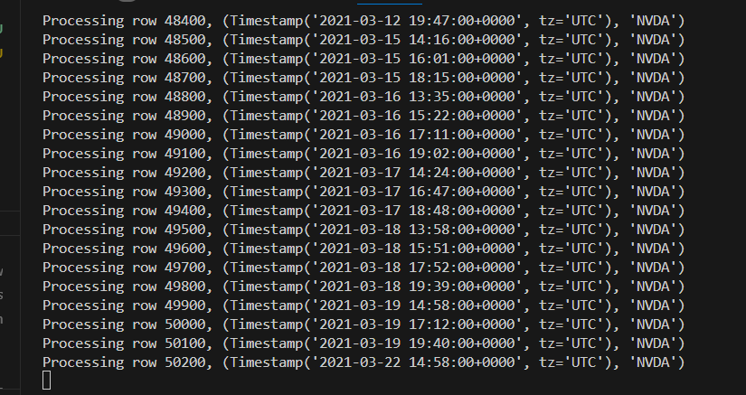

The synthetic data + step wise position changing RL using NLP extracted features of surrounding nodes as state information way underperforms the one-step technique based on LLM, now that I've got the LLM based model working after some prompt engineering. 

> baseline is the average edit distance from the tree given to the models, to the tree with correct order
> 
I'm personally very unsatisfied with that, and can't seem to find proper way to further improve the RL model's performance to close the gap (not even slightly; the latest RL model isn't even performing close to the LLM based technique) so I'm switching back to the backup plan of implementing RL based tradebot, reusing some of my previous code base of a RNN based price prediction model.

Up until now, I've 
- revamped the indicator generation process to use the more recent `stock_indicators` library.
- performed overhaul for the trade simulation process (still haven't introduced slipperage, but did introduce the realistic "failed position", where if the highest price during the new minute is lower than order price, the order will be cancelled, and a penalty will be provided for the bot)
- performed overhaul for the order placement process (account in sim folder)
- Setup a naive DQN model that take in the indicators together account info (cash, position, order) as state, and outputs the action of either buy, sell, or hold.

Since the switch to this backup plan is quite late, I still do not have a complete model to show at the moment. But I'm confident that what I present after thanksgiving break will be a complete model.

The next step next step is to create the new visualization for training & testing, and iterate on the model's structure, hyperparameters, and state features. And also try to speed up the training process by batching the gradient update; right now it is only doing ~60 rows persecond (~1.6 seconds per 100 rows)
